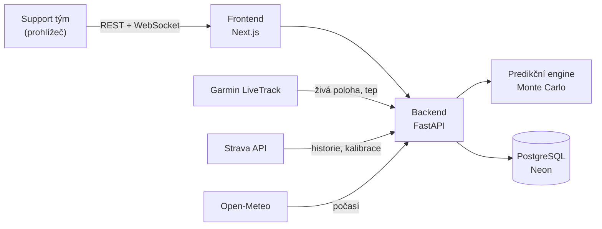

<div align="center">

# 🏃‍♂️⏱️ Race Time Tracker

**Predikce času doběhu na konkrétní trase — aby support tým věděl, v jakém čase běžce čekat na občerstvovačkách, checkpointech a v cíli.**

[**▶ Živá aplikace**](https://race-tracker-frontend.onrender.com) · [Návod pro uživatele](NAVOD.md) · [Onboarding](ONBOARDING.md) · [Nasazení](DEPLOY.md)


</div>

---

## Co to umí

- 📈 Z **GPX trasy** spočítá výškový profil a rozdělí ji na úseky po ~100 m.
- ⏱️ Odhadne **čas průchodu každým kilometrem** — v rozptylu (P10–P90), ne jen jedno číslo.
- 🏔️ Zohlední **převýšení a sklon, postupnou únavu, počasí, běh za tmy a zastávky na občerstvovačkách**.
- 🔗 Načte **historii běžce ze Stravy** a přizpůsobí predikci jeho reálné formě.
- 📍 Za závodu sleduje **živou polohu z Garmin LiveTracku** a průběžně predikci zpřesňuje.
- 👥 **Účty a sdílení** — každý vidí svoje závody, může pozvat support tým; přihlášení bez hesla (magic link).

## Jak funguje predikce

Trasa se rozseká na úseky po ~100 m; pro každý je znám sklon a nadmořská výška. Čas se
počítá **Monte Carlo simulací** (tisíce běhů s navzorkovanými nejistotami), do níž vstupuje:

| Vliv | Jak se promítá |
|------|----------------|
| **Sklon / převýšení** | Grade-adjusted pace podle Minettiho energetické náročnosti běhu; do kopce i prudký sběh zpomalují |
| **Únava** | Multiplikativní faktor rostoucí s uběhnutou vzdáleností; koeficient se učí z historie a za závodu se upřesňuje |
| **Počasí** | Předpověď z Open-Meteo pro daný úsek a čas — teplo, déšť/bláto, sníh, mlha |
| **Tma** | Východ/západ slunce (`astral`) pro polohu a čas úseku → noční penalizace |
| **Občerstvovačky** | Lognormální doba zastávky přičtená k času průchodu |
| **Živě za závodu** | Garmin LiveTrack (poloha, tempo, tep, kadence) → bayesovská rekalibrace, kardiální drift; rozptyl se s časem zužuje |

Z distribuce tisíců simulací vznikne pro každý bod **P10 / P50 / P90** — čas „od–do" spolu s mírou jistoty.

## Architektura



## Technologický stack

- **Frontend:** Next.js (React, TypeScript), grafy Recharts
- **Backend:** Python + FastAPI; predikce = Monte Carlo (Minetti GAP model, únava, počasí, tma `astral`); polling přes APScheduler
- **Data běžce:** Garmin LiveTrack (živá poloha), Strava API (historie + osobní kalibrace)
- **Databáze:** PostgreSQL (Neon)
- **Auth:** magic link (bez hesla), JWT session, e-maily přes Gmail SMTP; allowlist + admin sekce
- **Hosting:** Render (backend + frontend), Neon (DB) — vše v cloudu 24/7

## Rychlý start (lokálně)

Backend (Python 3.11+):

```bash
cd backend
python -m venv .venv && . .venv/Scripts/activate   # Windows: .venv\Scripts\Activate.ps1
pip install -e .[dev]
uvicorn app.main:app --reload --port 8000
```

Bez `DATABASE_URL` se použije lokální SQLite — pro vývoj není potřeba nic dalšího.
Konfigurace: viz [`backend/.env.example`](backend/.env.example).

Frontend (Node 20+):

```bash
cd frontend
npm install
npm run dev
```

Aplikace: http://localhost:3000 · API + OpenAPI docs: http://localhost:8000/docs

Testy: `cd backend && pytest`

## Struktura projektu

```
backend/
  app/
    api/          # REST endpointy (races, runners, strava, auth, admin, ws)
    auth/         # magic link, JWT, přístupová práva
    services/
      prediction/ # Monte Carlo engine, GAP model, únava
      tracking/   # Garmin LiveTrack adaptér, mapování polohy na trasu
      history/    # Strava klient + osobní kalibrace
      route_service.py, weather.py, darkness.py
    models.py, schemas.py, config.py, migrations.py
  tests/
frontend/
  app/            # Next.js stránky (/, /login, /auth/verify, /admin)
  components/     # profil trasy, tabulky, editory, sdílení
  lib/api.ts      # API klient
render.yaml       # nasazení (backend + frontend na Render)
```

## Nasazení

Frontend i backend běží na [Render](https://render.com) (jeden `render.yaml`, blueprint),
databáze na [Neon](https://neon.tech). Push do `main` = automatické nasazení. Detailní
postup a proměnné: [DEPLOY.md](DEPLOY.md).

## Licence

[MIT](LICENSE) © 2026 Jakub Tichý
